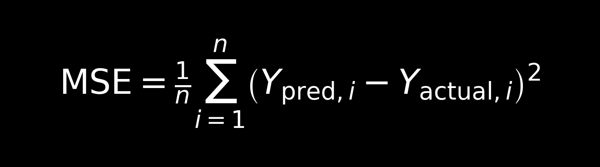
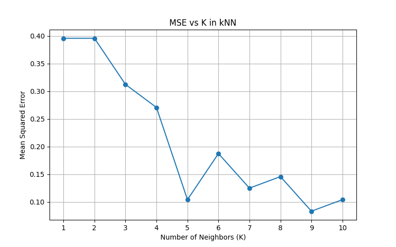

# **Heart Disease Survival Prediction Using KNN**

In this project, I build and evaluate a K-Nearest Neighbors (kNN) model to predict patient survival from heart failure, based on real clinical data. The goal is to explore the predictive power of simple yet meaningful features to support early risk assessment in clinical settings.

# **Table of Content**
- [00.Project Overview](#**00.ProjectOverview**)
  - [Context](##Context)
  - [Actions](##Actions)
  - [Results](##Results)
  - Next Steps
- [01.Data Overview](#**01.DataOverview**)
- [02.Feature Selection](#featureselection)
- [03.kNN Algorithm](#knnalgorithm)
- [04.Model Evaluation (MSE)](#modelevaluation(mse))
- 05.Optimal K selection
- 06.Results Discussion
- 07.Limitations & Future Work

# **00.Project Overview**
## Context 
Accurately identifying high-risk patients can support timely interventions, closer monitoring, and more personalized care planning, ultimately aiming to improve outcomes and resource use in clinical settings.

In this project, I implement a K-Nearest Neighbors (kNN) classifier to predict whether a patient died during the follow-up period. I use data from 297 patients, selecting only three clinically relevant features:

- Age
- Creatinine Phosphokinase (CPK) — a marker of cardiac muscle damage
- Ejection Fraction (EF) — a measure of heart pumping efficiency

These features are simple yet well-established indicators of cardiovascular risk in medical literature.

## Actions
- Used the first 250 records as the training set and last 47 records as the test set.
- Built a kNN classifier from scratch using NumPy.
- Computed predictions for K = 1 to 10.
- Evaluated each model using Mean Squared Error (MSE) on the test set.
- Visualized the performance of different K values to determine the optimal setting.

## Results
Lowest MSE achieved at K = X (fill in based on your results)

Larger K values generally improved stability but risked underfitting.

The model showed clear patterns linking patient age and low EF with increased risk of death, validating the medical relevance of the features used.

# **01.Data Overview**
- Dataset: `heart_data.csv`
- Records: 297 patients
- Binary target: `DEATH_EVENT` (0 = survived, 1 = died)
- Train/Test Split: 250 / 47

## **02.Feature Selection**

I selected three predictors based on their interpretability and medical relevance:

| Feature                    | Description                     | Reason for Inclusion                                |
|----------------------------|----------------------------------|-----------------------------------------------------|
| `age`                      | Patient age                     | Age is a well-known mortality risk factor           |
| `creatinine_phosphokinase`| Enzyme indicating muscle damage | Higher levels may reflect heart failure             |
| `ejection_fraction`       | Blood pumped out per beat       | Lower values strongly linked to poor outcomes       |

# **03.kNN Algorithm**
- Implemented manually using Euclidean distance in 3D feature space.
- For each test point:
  - Calculate distance to all training points.
  - Select the K closest neighbors.
  - Predict the majority class (0 or 1) among those neighbors.

# **04.Model Evaluation (MSE)**
I used Mean Squared Error (MSE) as a performance metric:

This gives a penalty for incorrect predictions, and helps identify which K leads to the most accurate predictions on the unseen test set

# **05.Optimal K Selection**

#**06.Results Discussion**

#**07.Limitations & Future Work**

